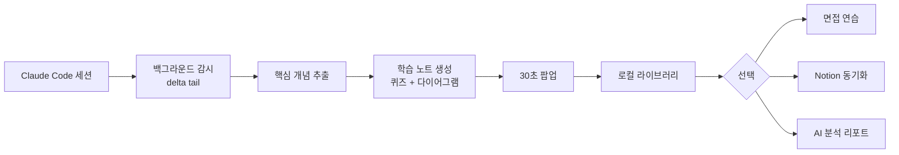

<div align="center">

# Snap Learn

**Claude Code 로 만들고 잊기 전에, 개념부터 다시 잡는다.**

macOS 데스크톱 앱 · 백그라운드에서 세션을 따라가며 놓친 핵심 개념을 학습 노트·퀴즈·면접 질문으로 자동 복원합니다.

[](#설치)
[](./LICENSE)
[](#로드맵)

[설치 (DMG)](https://github.com/letYuchan/snap-learn-open/releases/latest) ·
[기능](#핵심-기능) ·
[왜 만들었나](#왜-만들었나) ·
[설정](#설정)

</div>

---

## 왜 만들었나

Claude Code 같은 AI 코딩 도우미 덕분에 **결과물은 빨라졌지만**, 정작 그 코드를 만든 본인은 "왜 그렇게 동작하는지" 설명하지 못하는 경우가 늘었어요.

- 개념 정리할 시간이 없다 — 다음 작업이 바로 들어오니까.
- 다음 면접에서 같은 주제가 나오면 막힌다 — 만든 적은 있는데 설명을 못 한다.
- 뒤늦게 정리하려면 무슨 세션이 중요했는지 기억나지 않는다.

**Snap Learn 은 그 격차를 백그라운드에서 메워주는 macOS 앱**이에요. 개발 흐름을 끊지 않습니다.

---

## 핵심 기능

### 자동 감시 → 30초 학습 팝업

Claude Code 세션을 백그라운드에서 따라가다가 의미 있는 순간이 오면 작은 팝업 카드로 핵심 개념을 정리해 줍니다. 사용자는 30초만 보면 끝.

> 세션 따라잡기(`tail`) · 오프셋 저장 · 델타 단위 처리 — 같은 개념을 두 번 안 보여줍니다.

### 1문1답 10회 면접 모드

저장된 노트나 자유 주제로 시니어 인터뷰어(난이도 1~5)와 1문1답을 10회 진행합니다. 답변마다 **정확성·깊이·트레이드오프·명료성** 4축으로 채점, 끝나면 평균 점수와 코칭 한 마디.

### 코어·트렌드·뉴스 자동 큐레이션

세션이 없는 날에도 비어 있지 않습니다.
- **코어** — Kleppmann/Tanenbaum 급 고전에서 5~20년 유효한 기초 한 개
- **트렌드** — 최근 1~2년 안에 부상한 실전 주제 한 개
- **뉴스** — 관심사 기반 데일리 디지스트, 1차 출처 우선

### AI 분석 리포트

학습·면접·퀴즈 신호를 모아 **너는 어떤 타입의 개발자인가** 를 한 장으로 보여줍니다. 강점/약점/이번 주 미션/잘 어울리는 환경까지.

> AI 가 만든 노트 내용은 "관심·노출" 신호로만 해석합니다. **앎의 증거는 면접 답변과 퀴즈 결과뿐** — 노트에 들어 있다고 너가 안다고 단정하지 않아요.

### Notion 동기화 (선택)

학습 노트·면접 기록·뉴스 카드를 Notion DB 로 한 번에 보낼 수 있습니다. 로컬이 기본, Notion 은 옵션.

---

## 어떻게 작동하나



---

## 스크린샷

> 캡처 추가 예정 — `docs/screenshots/` 에 PNG 가 들어가면 자동으로 보입니다.

| 학습 노트 팝업 | 면접 연습 | AI 분석 리포트 |
|---|---|---|
|  |  |  |

---

## 설치

### 1. DMG 다운로드

[Releases](https://github.com/letYuchan/snap-learn-open/releases/latest) 에서 최신 `.dmg` 다운로드 → `Snap Learn.app` 을 `/Applications` 로 드래그.

> Apple Silicon(arm64) 전용. Developer ID 로 서명되어 있습니다.

### 2. Claude CLI 로그인

Snap Learn 은 LLM 호출에 [Claude CLI](https://docs.claude.com/en/docs/claude-code) 를 그대로 사용합니다. **별도 API 키가 필요 없습니다** — Claude Code 와 동일한 계정·요금이 적용돼요.

```bash
# 미설치라면
brew install anthropic/tap/claude

# 로그인
claude login
```

### 3. 처음 실행

앱 첫 실행 시 온보딩이 권한·설정을 안내합니다 — 알림 권한, Claude CLI 감지, 학습 노트 저장 폴더 선택.

---

## 설정

### 모드 밸런스

세션 / 코어 / 트렌드 비중을 슬라이더로 조절합니다. 기본 50 / 30 / 20.

| 상황 | 권장 |
|---|---|
| 매일 Claude Code 로 코딩 중 | 70 / 20 / 10 — 실전 맥락 우선 |
| 학습기·전직 준비 | 30 / 50 / 20 — 코어 기초 누적 |
| 정보 큐레이션 위주 | 0 / 0 / 0 + 뉴스 모드 ON |

### 감시 주기

1·3·5·15·30·60 분 중 선택. 짧을수록 자주 띄우지만 토큰 사용량 증가.

### Notion 연동

Settings → Notion 에서 Integration Token + Database ID 입력. 각 모드(학습·뉴스)마다 별도 DB 지정 가능.

---

## 프라이버시 · 비용

- **로컬 우선** — 모든 노트·면접 기록은 사용자 PC 에만 저장. Notion 은 사용자가 명시적으로 보낼 때만 동기화.
- **자체 호스팅 모델 없음** — Claude CLI 가 처리하므로 토큰은 본인 Anthropic 계정 한도 안에서 소비.
- **사용량 가시화** — Usage 탭에서 모든 호출의 prompt/response 글자 수·소요 시간·성공률 확인 가능.

---

## 로드맵

- [ ] 컬처핏 면접 모드 (HR 페르소나, STAR 채점)
- [ ] Linux/Windows 빌드
- [ ] 면접 transcript Notion 풍부화 (점수 차트 임베드)
- [ ] 학습 노트 임포트/익스포트 (Markdown bundle)

---

## 기여

이슈·PR 환영합니다. 코드 스타일은 [`.claude/skills/code-style/SKILL.md`](.claude/skills/code-style/SKILL.md) 를 참고해 주세요.

---

## 라이선스

[MIT](./LICENSE) — Keep learning without breaking the flow.
